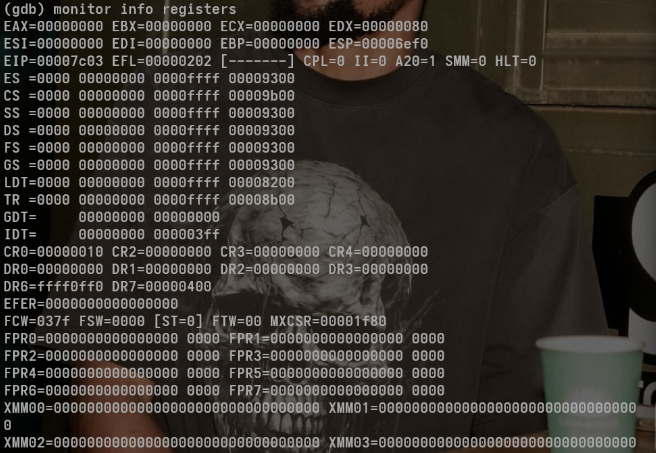
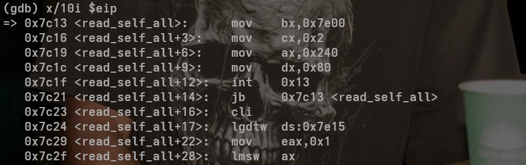
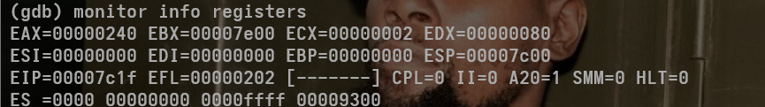
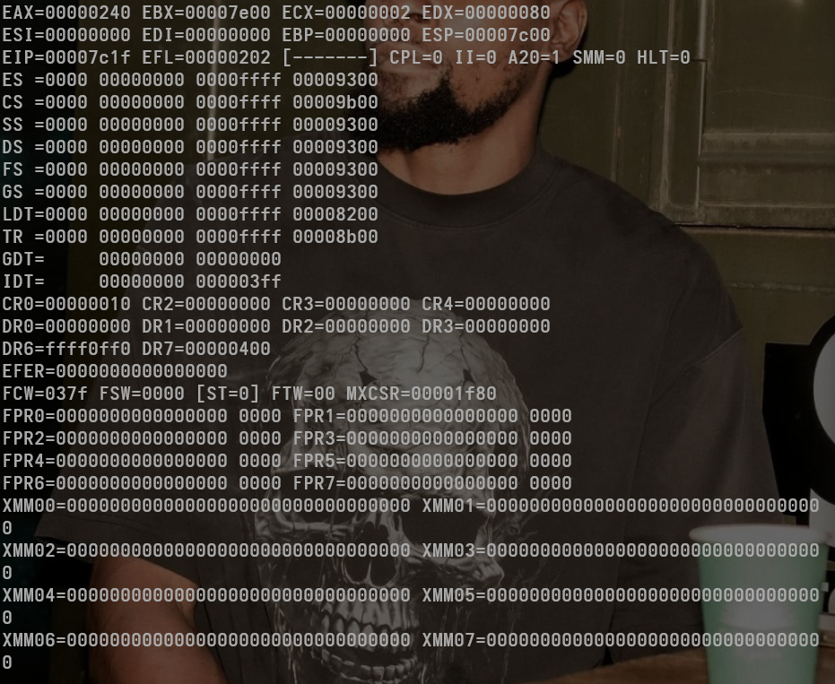
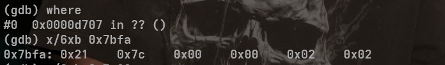
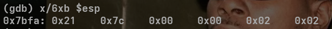
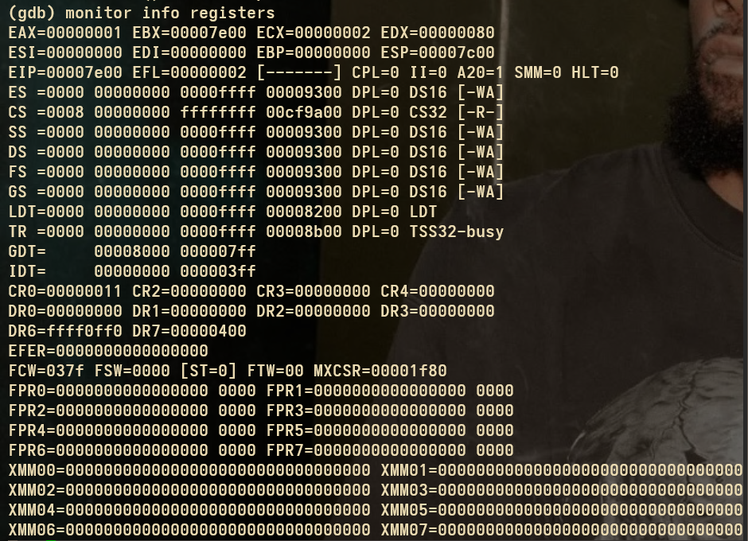

# 简介
接下来就到了保护模式下的操作了. 理解上确实比较有困难, 但是呢, 怎么说呢, 还是比较困难的. 但是理解了, 也就好很多了. 目前来看, 对于`c`中创建的结构体, 确实有些还是不太明白的, 但是也没办法, 所以选择忽略, 最关键的知道什么含义即可.

- [段寄存器](#段寄存器)
- [重新分析](#重新分析)
- [底层分析](#底层分析)

## 段寄存器
- 在保护模式下, 段寄存器的功能拓展了很多很多. 首先, 对于`16`位的段寄存器, 整体划分上, 分类如下:
    - 高`13`位, 代表`index`, 每一个类型, 表示`GDT`对应的索引, 所以, 最多可以有`2^13`个`GDT`索引表.
    - 低`2`位代表`RPL`, 什么意思呢?就是特权等级的意思. 这么来看, 一共有`4`种特权等级.
    - 中间的那一位, 就是选择索引表的类型. `0`是`GDT`表, `1`是`LDT`表. 
        - 确实是这样的. 所以左移的含义很明确, 就是为了兼容其它位, 然后将整个位当做地址去访问. 这种表示方式, 确实是没有见过的. 但是在这里呢, 就很明确了. 
    - 这样, `cpu`只需要通过段寄存器, 就能找到索引表. 而用户只需要提供选择子, 就能轻松找到.
- 之后, 进入到`GDT`表中, 它的样式也是规定好的了. 首先明确, `GDT`是在内存中, 而不是寄存器, 这样我们就可以起到拓展的效果了. `GDT`内部有四个类型的变量(这里就称之为变量吧, 因为在`C`中, 确实是用变量表示的) 其中, `limit_low`变量是代表`LIMIT`的低十六位, 表示最大偏移量. 而`base_low`, 代表的`BASE`的低十六位, 表示的是基地址. 其它的呢, 有些是属性位, 还有`BASE`的其他位, `LIMIT`的其它位. 知道就行, 至于作用吗, 也不用细究, 我深入明白后, 再来说吧. 
- 由于`limit_low`和`base_low`, 分别都是十六位, 所以, 当`base_low`为`0x0000-0xffff`, `limit_low`为`0xffff`时, 最大寻址为`2^32`, 也就是`4G`线性空间

## 重新分析
上面说的非常不好. 这里再重新分析一下吧. 
- 保护模式下,`cpu`如何寻址呢? 且看如下指令码.
~~~C
mov eax, [ds:0x100]
~~~
- 上面的`0x100`是`offset`, 也就是偏移量. 而`ds`是对应的段寄存器.
- `limit`, 是允许偏移量, 而不是`offset`赋值给它. 主要是检查`offset`是否越界.
- 那么`limit`最大值是多少? 是其低十六位+高四位. 其中, 低十六位, 可以单独放在某个`u16`变量中, 高四位需要组合存放.
    - 比如, `limit_low = 0xFFFF`, `limit_high = 0xF`, 那么`LIMIT = 0xFFFFF`. 也就是当前`offset`最大范围.
    - `G`位再`Flags`中, 决定`Limit`的单位, 其中`0`是字节单位, 最大段大小为`1MB`(`2^20bytes`), 而`1`是`4KB`单位, 最大段大小为`4GB`(`2^20*4KB = 4GB`).这是最大寻址范围, 不是上面说的那些. 
    - 注意, `BASE`一般都设为`0`, 这样, 最大寻址`BASE+LIMIT`, 就是`4GB`了(`ai`说, `base`一般设为`0`, 也有不设为`0`的情况, 这里就不太细究了)
    - 另外,`G=1`, 实际上, `cpu`将`Limit`左移了`12`位, 也就是乘了`4KB`
- `GDT`表结构如下. 我觉得不是很清晰, 但是, 还是不错的.
~~~pgsql
31                            16  15                         0
+------------------------------+------------------------------+
| Base 31:24                   | Limit 19:16 | Flags (G,D,B,L,AVL) |
+------------------------------+------------------------------+
| Access Byte                  | Base 23:16                   |
+------------------------------+------------------------------+
| Base 15:0                     | Limit 15:0                   |
+------------------------------+------------------------------+
~~~
- 拆开, 对应到`C`结构体中来看
~~~C
typedef struct __attribute__((packed, aligned(8))){
    u16 limit_low;      // Limit 低16位
    u16 base_low;       // Base 低16位
    u16 base_mid_attr;  // Base 16~23位 + Access Byte
    u16 base_limit;     // Base 24~31 + Limit 高4位 + Flags
} GdtEntry_TypeDef;
~~~
- `limit_low`就不说了
- `base_low`也不说了
- `base_mid_attr`, 高`8`位, 是`Base`的`16~23`位, 低`8`位是`Access Byte`
    - `Access Byte` 重要字段如下
    ~~~ pqsq
    Access Byte (8 bit)
    7 6 5 4 3 2 1 0
    P DPL  S  Type
    ~~~
    - `P:1`为段存在, `DPL`为段特权等级(`0~3`), `S:0`系统段, 否则, 代码/数据段 `Type`段类型(可执行, 可读, 可写等)
- `base_limit` 高`8`位是`Base`的`24~31`位, 低`8`位是`Flags`+`Limit`的`16~19`
    - `Base 24~31`, 组合的话, 就是`Base = base_low+base_mid<<16 +base_high<<24`
    - `Limit 16~19`, 段界限的高`4`位
    - `Flags`代表如下
    ~~~objectivec
    Flags (4 bits) = G D/B L AVL
    ~~~
    - `G:0`字节, 其它为`4KB`
    - `D/B`, `0`:`16`位, `1`:`32`位
    - `L`, `1`:`64-bit`, `0`:`32-big`
    - `AVL`操作系统可用, 自定义用途.
- 所以来看, 那个结构体中的内容, 都是十分有用的. `Base`是`32`位的, `Limit`是`20`位的.线性地址一定超过了物理地址. 那么该问题是怎么解决的呢? 目前还没有涉及到, 我们先不分析.

## 底层分析
- 上面说了很多, 容易理解也好, 其它的也罢, 不过总感觉还是缺少了什么. 那么缺少了什么呢? 可视化, 缺少反馈. 所以, 在上面的基础上, 这里再重新进行底层分析, 让我们更加深入地理解, 知道自己在做什么. 
- `x86`的`8086`体系下的计算机, 通用寄存器跟段寄存器, 都是`16`位的, 这是`cpu`内部设定好的. 但是, 此时地址总线是`20`根, 可寻址范围是`2^20`个, 所以, 一个段寄存器无法完全表示, 所以, 只能用`base*16 + offset`寻址. 
    - 关于`offset`, 谁提供的呢? 可能在指令码里会有, 比如`base:offset`的形式(上面说过), 但具体细节这里不做考究. `offset`可能会存放在一个`16`位的偏移寄存器中.
    - 为什么会乘`16`呢? 这里代表的是左移`4`位. 为什么要左移`4`位呢? 因为一个`16`位段寄存器, 可表示寻址范围是`2^16`, 而总线`20`根, 相差`4`, 正好左移`4`位, 可以解决.
    - 可是, 为什么要加`offset`呢? 首先, 考虑一下, `offset`是`4`位十六进制数, `base*16`是`5`位十六进制数, 可以代表可寻址空间中的所有基地址. 这样, 我们根据基地址, 加上偏移量, 就是目标寻址的地方.
    - 之前, 总是考虑, 偏移寄存器不是只需要一位, 就够用了吗? 当时的想法可能是, `base`的`4`位, 加上`offset`的`1`位, 组成了`5`位, 正好解决了这个问题(`16`进制的). 
        - 确实, 这么来看, 正好是`5`位.
        - 这种思想, 似乎是组合拆解的思维逻辑. `1`个寄存器不够用, 那么, 我用`2`个寄存器组合一下不就行了?
        - 而且, 跟上面的不同, 这里的第二个寄存器, 只用了`1`位(`16`进制), 还有`3`位没有使用, 空闲出来, 不就可以干其它的事了吗?
            - 这种设计思想, 完全没有任何问题, 一定可行. 我们只要覆盖可寻址范围即可.
            - 那么问题在哪里呢? 如果, 我们用两个寄存器, 覆盖了范围, 那么, 这两个寄存器, 相当于组合成一个大的寄存器(`5`位`16`进制), 这一个大寄存器, 用来表示基地址. 那么偏移怎么表示呢? 还需要一个寄存器, 用来表示偏移.
            - 关于偏移寄存器的选择, 需要看架构设计要求. `8086`体系下要求, 保护模式下的一个段, 必须有`64KB`空间(`2^16`), 这是硬性要求. 所以偏移寄存器只能是`16`位的. 
            - 这样, 一个大寄存器+一个小寄存器, 也解决了问题. 可是总共用了`3`个寄存器. 
        - 怎么样, 这么来看, 明白为什么不采用寄存器的组合了吗?
    - 我们用`10`进制数, 分析一下, 会更好地明白, 为什么采用这种思想. 比如, 我现在有两个`10`进制的`3`位寄存器, 可是发现无法满足需要. 我需要覆盖`4`位十进制的空间. 此时, 没有任何限制, 可以用位相加思想来解决. 也可以采用上面说的算法. 其中一个寄存器左移一位, 然后加上另一个寄存器的数, 就可以满足要求, 覆盖所有空间.
    - 比如, 第一个寄存器表示`999`, 这样, 左移`1`位, 变成了`9990`, 另一个寄存器取`9`, 相加后变成`9999`, 也就是`4`位十进制空间最大值. 最小值肯定为`0`.这样不就满足要求了吗? 
    - 而且, 这种寻址的最大范围, 其实是`9990+999`, 稍微超出了一些. 所以, 实际中也会超出目标范围的. 但是内部肯定有保护机制保护的.
    - 假如, 我想覆盖`5`位十进制空间, 用两个`3`位寄存器, 还是否能满足需求呢?
        - `999`左移两位, `99900`, 另一个寄存器只需要`99`, 就能覆盖空间.
        - 所以, 空间覆盖, 最多只能覆盖寄存器位数的`double`位, 超过的话, 偏移寄存器就不够用了.
    - 所以, 对于`16`进制而言, `4`位是不够用的, 需要再添加`1`位. 而`5`位小于`4*2`位的, 所以, 可以满足算法要求. 这也就是`intel`选择的算法, 可以少用一个寄存器, 而能满足需求. 
    - 这样选择的问题是, 基地址只能在`2^16`之内选择. 
    - 至于为什么这么设计呢? 肯定是为了解决各种问题的. 他们面对的什么问题, 我不得而知, 只能学习了解. 而且地址线为什么不跟`cpu`位数符合起来呢, 这样似乎更好的能设计.
- 而对于`80386`体系下的计算机呢, 通用寄存器变成`32`位的了, 段寄存器还是`16`位的, 所以, 基本的寻址算法, 还是跟上面是保持一致的.
- 保护模式下的寻址, 味道就变了. 我们先来看一下基本图吧.

    

- 图中很明显地表示了, 此时`cpu`运行停在了第十二行.部分代码如下.
~~~C
_start: 
	mov $0, %ax
	mov %ax, %ds
	mov %ax, %es
	mov %ax, %ss
	mov %ax, %gs
	mov %ax, %fs
	mov $_start, %esp	
~~~
- 其中, 第二行就是我的代码中的第十二行.`cpu`寄存器显示内容如下.

    

- 这是较为完整地显示了. 此时还是实模式下, 其中, `CS`是段寄存器, 存放`code`的部分, `DS`是数据段(`data`)寄存器. 这是我们下面重点关注的. 关于二者结构, 下面再说. `GDT`是`GDTR`寄存器, 也就是`GDT`表的寄存器, `IDT`也是一个道理, 这些后面再说. 
- 我们先来分析前面的(实模式).
    - 一开始的`EAX`寄存器, 有`8位`十六进制, 总共`32`位, 其它的通用寄存器也是一个道理. 我们上面说了, 对于`80386`架构的`cpu`, 通用寄存器是`32`位的, 满足我们预期.
    - 接下来, `EAX`值是`0x0000aa55`, 也是初始的数, 之前没有清楚的. 关于`0xaa55`, 是很关键的一个数, 它是`bios`可执行引导扇区的一个标志符. `bios`从`0x7c00`开始被加载, 其总长度为`512B`, 所以地址需要到`0x7e00`. `0x7e00`的前两位是`0x7DFE`和`0x7DFF`, 这两个地址需要被赋值为`0x55`和`0xaa`, 而寄存器`EAX`存储的就是`aa55`.
        - 至于为什么是这两个数, 大家可以去搜一搜. 到目前, 计算机似乎仍使用这个"魔数".
- 我们往下运行(注意看上面的汇编代码)
- 此时寄存器`ax`(也就是寄存器`EAX`的低十六位)被赋值为`0`了, 我们输入`stepi`, 看看寄存器`EAX`运行, 是否满足需求.

    

    

- 此时运行到了`13`行(上面我贴的代码, 自己比对.), 而`EAX`寄存器, 确实被赋值为`0`了, 满足预期.
- 接下来继续执行. 我们看到, 代码将所有的段寄存器赋值为`0`了.这是什么含义呢?
    - 首先思考思考, 实模式下, 段寄存器是存储什么的? 基地址. 基地址+偏移地址就是真实的物理地址. 可是, 物理地址是什么含义? 物理地址为什么能存储值? 
        - 物理地址, 其实也是我们人为抽象出来的. 就像是一个数组下标, 我们通过该下标, 可以访问其内容.
        - 谁的物理地址? 内存的, 也就是`RAM`, 那么`RAM`是如何存储值的? 我们也可以将`RAM`抽象成有许多个"寄存器"的容器(当然, 实际是能存储高低电平的电子晶体管, 这部分具体原理不说了, 我也不太了解.). 所以, 每一个"寄存器", 都对应一个"编号", 而这个编号, 就是我们说的物理地址.
        - 这样, `cpu`内部虽然有很少的寄存器, 但是, 可以向外拓展一下. 拓展后, `cpu`如何访问呢? 就回到上面说的了.
            - `cpu`内部段寄存器, 存储基地址, 偏移寄存器存储偏移地址. 基地址+偏移地址 = 物理地址, 通过该物理地址("数组下标"), 就能访问到对应数据(晶体管内系列高低电平表示的二进制数.)
- 实模式下, 段寄存器, 每段是`64KB`, 硬性要求的, 这里我们编写`os`, `64KB`足够存储我们所有的代码了, 所以呢, 这里我们默认所有的段寄存器起点, 从`0x0000`开始, 这样我们只需要通过`offset`, 就能得到目标地址下的值了.(总共`1MB`可用, 这里我们只用了`64KB`, 其实更少.)
- 所以, 上面说的地址, 比如`0x7c00`啊, 就是内存的"下标", 为了访问内部数据的. 从这开始, 是`bios`加载的引导扇区, 而且是硬性规定的. 后面紧跟的`512`字节, 就是这些内容. 
- 寄存器`eip`是存放指令地址的. 我们来看一下. (注意, 命令式`x/10i $eip`, `eip`就是一个指针, 一直指向着指令地址处. `$eip`是取值的意思.`i`是以汇编显示.)

    

- 从上课件, `epi`存储的是什么呢? 就是地址信息啊, 而地址信息下面对应的值, 正好是我们写好的代码. 这么巧吗? 
    - 注意看地址, `0x7c03`, 是`0x7c00`后面的几位, 这部分不是存放着`bios`吗? 怎么存储的是我们自己的代码呢? 所以说, `bios`, 在固存中, 引导完(执行完)后, 又接着引导至内存中. 我以前以为, 是将`bios`代码`copy`到内存中, 但这么来看不是.
    - 这部分代码(`bootloader`), 实际存在于磁盘中. `bios`将其加载到内存中, 然后执行. 是这样吗? 
    - 我明白了, 是那张图误导我了, 导致我以为`bios`会一同被加载到内存中.
    - 实际上, `bios`在`rom`中, 开机自启动, 之后, 会将`bootloader`加载到内存中, 从`0x7c00`, 往后`512`字节. 所以, 我们自己写的`start.s`文件中的代码, 会被加载到这部分来. 
- 那么就没问题了, 整个逻辑也合理了, 我们想查看代码, 也能更好地查看了. 
- 而且, 从汇编->二进制代码, 也有了更好地指引转向了. 
- 我刚才以`x/10x $eip`命令查看了一下, 发现汇编代码用机器码(二进制(十六进制))表示方法. 这样不就勾引出兴趣了吗? 后面肯定会去了解一下的. 这里, 我们还是以`os`为主, 不做额外拓展了.
- 接下来, 我们要干什么呢? 还是逐步分析一下代码吧. 因为这代码我也是抄过来的, 还未跟硬件建立联系, 所以仍然是比较懵的. 慢慢来, 好好地分析一下. 所以就不设置断点, 然后`continue`了, 只是一步一步地`stepi`查看.
- 现在来看看, 运行到哪里了.

    

- 看到, 运行到`0x7c13`了, 不过, `0x7c0d`中显示的是`esp`, `0x7c00`, 但是看代码的话, 我写的是`_start`, 这说明了什么?
    - 显而易见, `_start`是`bootloader`的开始处, 也就是我写的`start.S`的第一部分. 虽然, 我不知道`_start`什么含义, 但这么来看, 它表示的就是首地址处, 也就是`bios`指引`cpu`加载启动代码的地方.
- 然后, 这个地址值(注意, 我说的不是地址, 而是地址值)被存储到寄存器`esp`中了. 这个寄存器的值, 应该变为`0x7c00`, 来看看, 是不是符合预期.

    

- 没有问题, 符合预期. 那么, `ESP`寄存器是干什么用的呢? 这是一个通用寄存器, 不过为什么要存储下来呢?
    - 查询了一下, 它确实是通用寄存器, 但是, 也不是一般的寄存器, 是栈寄存器, 总会指向栈顶.
    - 仔细想了想, 哈哈, 明白了. 源代码设置的栈区, 是从`0~0x7c00`, 所以呢, `esp`寄存器, 应该就是设置栈区的寄存器了. 那么设置为`_start`就没有任何毛病了. 我们可以查看一下`_start`的地址.

    

- 那么, 一切就都解释的通了, 我们再接着往下看吧.
- 另外, 根据上面的内容, 我们随时也能看到`eip`寄存器的值的, 总是随着代码执行而逐步往下执行的, 没有任何毛病的.

    

- 上面的指令, 是什么意思呢? 
    - 需要注意的是, 我们`os`的源代码, 太长, `512b`空间根本不够用. 那么这个问题如何解决的呢?
    - 简单来说, 就是加载磁盘的`os`源代码到内存中(`0x7e00`之后), 然后顺序执行即可. 现在的问题是, 怎么加载`os`呢? 它是在磁盘中, 如何操作呢?
    - 首先要明确, 我们的`bootloader`(也就是`start.s`处的代码), 无权操作硬盘. 但是呢, 可以通过`bios`中断, 加载硬盘(比喻一下吧, 因为具体原理我也不清楚).
    - 内部代码, 有个`int 0x13`, 就是对应的中断向量表, 告诉`bios`, 去执行该地址处的中断函数.
        - 我觉得, 这个`0x13`代表的应该是`bios`在`rom`处的地址, 而不是`ram`地址.
    - 然后呢, 想加载该磁盘, 需要符合一定的规范, 这也是为那几个通用寄存器赋值的原因. 具体的我也不说了, 大体说一下, 比喻一下, 能理解就行, 虽然也不一定对. 
    - `bx` 存储地址, 就是告诉`cpu`, `os`需要加载到哪里, 这里表示的是加载到`bootloader`之后(`0x7e00`).
    - 接下来, 给`cx`, `ax`, `dx`的赋值, 就是告诉`bios`, 磁盘的哪个扇区, 等等(就是`os`代码所存储的位置, 能够找到), 这些有规范的, 不是胡乱写的.
    - 内部有个标志位寄存器, 判断是否加载成功, 没成功的话就会反复加载.
    - 在重申一下`int 13`的含义, 调用 `BIOS `硬盘服务，把硬盘扇区的数据读到内存. `0x13`代表让`bios`执行哪个中断函数.
- 这部分, 其执行细节, 似乎也看不了, 我们也不再分析了.
- 接下来, 就是准备要进入`保护`模式了. 进入之前, 需要做一系列的准备.
- `cli`代表的是, 进步外部硬件中断. 在切换到保护模式之前, 如果有中断发生, `cpu`可能会访问还没有初始化好的`GDT`/段寄存器, 导致系统崩溃. 所以必须先禁止中断. 
- `LGDT`, 代表的是`Load Global Descriptor Table`, 加载`GDT`描述符表.
- `GDT`表, 是我们认为规定好的, 这里指定的是`gdt_desc`. 关于这个数组, 我们等会专门解释. 
- 下面的`mov $1 %eax` + `lmsw %ax`, 代表什么呢?
    - `LMSW`是`Load Machine Status Word` 设置`CR0`标志位, 开启保护模式标志位`PE`
    - 具体操作, `mov $1 %eax`->把`PE=1`的值, 放到`EAX`
    - `lmsw %ax`->只用`AX`的低`16`位, 将`PE=1`写入控制寄存器.
    - `cpu`切换到保护模式下后, 段寄存器不再默认左移`4`位寻址, 并且可以访问`32`位线性地址.
- 对于`jmp $KERNEL_CODE_SEG, $_start_32`, 保护模式开始后, `CS:IP`的旧值可能不正确, 必须通过远跳(`far jump`)指定新的段选择子+指令地址
- `$_start_32`表示内核入口地址.
- 远跳完成后, `cpu`正式进入保护模式, 执行`32`位代码`_start_32`
- 后面呢, `.org 0x1fe`, 指示汇编器将当前位置设置为内存偏移`0x1fe`, 确保`boot sector`左右两个字节在`0x1fe-0x1ff`. 其实, `bootloader`肯定没有写满`512b`, 这里就相当于直接引导到这里. 
    - 现在还没有验证, 但感觉, 这里的偏移, 似乎是相对于`_start`, 也就是`0x7c00`偏移的,不是`eip`指针指向的地址(代码运行区)偏移的.
- `.byte 0x55, 0xaa`, 是将这两个字节写入上面的两个地址中, 表示`bootloader`加载完毕, 下面开始加载`os`
- 上面的内容, `ai`了解了一下, 目前觉得十分清晰. 接下来, 就需要进入代码, 详细地理解一下了.

    

- 这几个通用寄存器, 显示确实没问题.
- 接下来, 我执行`stepi`, 程序将执行中断了(`int 13`), 有意思的事, 发生了.

    

- 此时发生了中断. 输入`where`, 也显示这个. 代表了什么呢?
    - 此时, `cpu`遇到了`int 0x13`, 触发了`BIOS`硬盘中断.`cpu`做了两件事
        - 压栈(`CS:IP`+`FLAGS`)
        - 查`IVT[0x13]`, 得到了`BIOS ROM`中断服务入口, 跳过去执行.
    - `GDB`为什么显示上面内容?
        - `GDB`是针对保护模式/操作体统的调试器
            - 它管理的是进程地址空间和符号信息.
            - 现在, 正处于实模式`16`位`bootloader`, 在`BIOS ROM`中执行`int 0x13`
        - `GDB`没有符号信息, 也不认识`BIOS ROM`
            - `BIOS ROM`地址通常在`0xF0000~x0000xFFFFF`
            - `GDB`找不到函数名, 所以显示`??`
            - `0x0000d707`是`cpu`当前的`CS:IP`/实模式偏移(`GDB`尝试翻译成线性地址)
    - 注意, 上述偏移地址, 显示在`EIP`中, 也就是当前代码执行位置上.
- 不好意思, 没有贴出图来. 下面先贴出来执行中断前, 寄存器信息.

    

- 下面是执行中断后的寄存器信息.

    

- 有几个变化了的寄存器, 这里说一下. `ESP`, `EIP`, `EFL`, `CS`
- 似乎就这几个. `ESP` 是栈指针寄存器. 一开始指向的是`0x7c00`(我们自己规定的, 上面说过了), 后续压栈的话, 该指针向下移动. 从`0x7c00-0x7bfa`, 向下移动了`12`(我也不知道咋算的. 但是, 确实是压入了`EIP`, `CS`, `EFL`, 但是压入的是时模式下的`16`位), 说明, 存储了一些东西.了解了一下, 发现, 栈压入的是`EFL`, `CS`, `EIP`寄存器的内容. 为什么保存这些信息呢? 因为执行中断函数去了, 执行完毕后, 根据栈中信息, 返回原函数执行.
- 所以, 我们输出一下, 看看跟中断前, 寄存器信息是否一致.

    

- 很明显, 没有太大问题. 不过, 至于怎么压栈, 按照什么顺序压栈, 我也不太清楚.
- 右侧两个`0x02 0x02`, 找到中断前的`EFL`寄存器, 可以看到, 内容一致. 中间的`0x00 0x00`, 跟`CS`一致. 不过, 左侧的`0x21 0x7c`, 跟一开始的`EIP` 的`0x00007c1f`, 不一样啊. 其实很简单, 思考一下, 中断执行结束后, 需要往下执行, 而不是重新执行这一步, 所以存储的时候, 存储的是下两位(我是这么理解的).
- 执行中断时, 发现, `CS`变化了. 为什么呢?
    - 中断发生时, `CPU`检查`IVT[0x13]`
        - `IVT[0x13]`存放了`BIOS ROM`中断服务入口:偏移
        - 这个地址通常在`F000:xxxx`(`BIOS ROM`内部)
    - `CPU`跳到这个段执行`BIOS`内部硬盘读逻辑
    - 所以`CS`自动变化为`BIOS ROM`段选择子(不太明确, 但知道这么做即可)
        - 看了下, 实模式中, `CS=0xF000`, `IP=0xD707`, 物理地址=`0xFD707`, 注意, 该物理地址是`ROM`中.
        - 为什么`ROM`跟`RAM`不会冲突?
        - 内存布局约定. 低端`0x00000~x0000x9FFFF`, 是`RAM`, 高端`x0000xF0000~0xFFFFF`是`BIOS ROM`
- 关于`EFL`标志寄存器, 这里就不分析了, 标志位, 知道即可. 比如是否允许中断, 是否开启保护模式(?)等.
- 接下来, 我一直按`stepi`, 发现, 一直执行中断函数, 哈哈.怎么退出呢? 今天先结束了, 明天再说吧.

    

- 上面的信息, 是退出中断后, 各寄存器信息.
- 主要看寄存器`EIP`, `EFL`, `CS`, `ESP`
    - 很明显, 执行完中断函数后, 这些寄存器恢复成原来的样子了.
    - `EIP`, 表示偏移地址, 也就是我们指令当前运行到哪.
    - `EFL`, 标志寄存器, 退出中断后, 恢复成原样.
    - `ESP`, 栈指针寄存器, 开始指向栈顶, 进入中断后, 存储(`push`)`EIP EFL CS`寄存器信息. 中断函数结束后, 会`pop`, 上述寄存器恢复原样. 关于`pop`, `push`, 这两个指令, 不是我们手动操作的, 可能是在中断函数中自动进行的(猜测的, 原理不懂. 我们自己写的函数, 不会主动进行这些操作, 所以底层原理是怎么弄的呢?).
    - `CS`寄存器, 属于段寄存器, 这里就不多说了.
- 另外, 还有一个关键点, 就是`gdb`显示与寄存器内部显示, 似乎不太一样. 

    

    

- 在中断函数中, `esp`栈指针寄存器, 指向的是`0x7bfa`, 但是呢, 我们向上, 查看了其相关信息, 可以知道, 从右往左, 依次压入, 也就是从高地址向低地址压入, 符合我们的设想.
    - 不过, 具体是怎么压入的呢?光看`EFL`的话, 似乎是将被压入的寄存器的值, 从低向高(从右往左压入)的, 这样, `0x02`, 正好满足. 可是真的是这样吗?
    - 看寄存器`CS`的话, 看不出来什么, 因为都是`0`
    - 但是, 寄存器`eip`给出了关键信息. 源地址是`0x7c21`, 被压入后, 显示的是`0x21 0x7c`, 说明并不是从低往高压入, 而是从高往低压入. 这样, 栈指针`esp`的高地址, 显示`0x7c`, 低地址显示`0x21`. 
    - 结合这个结论, 可以知道, `EFL`寄存器也是满足这个设想的.
    - 所以, 现在我们知道了, 寄存器状态显示与实际存储情况, 可能有些不想符. 真实情况也不好说, 只能由这些信息去推测. 这对于我们后续, 传入会有影响的, 但是目前来看, 真实状态确实不好说.

    

- 这些内容, 是段寄存器信息, 以及`GDTR`寄存器与`IDTR`寄存器信息.
- 这里还没有什么显示, 但是, 这部分寄存器内容是`C`与汇编相交互的, 结构不清楚的话, 这部分寄存器内容也就看不懂了.
- 上面一开始时就说了, 不论是`8086`, 还是`80386`结构`cpu`, 段寄存器都是`16`位的, 所以, 对于`ES CS SS...`而言, 他们显示的前`4`位(十六进制), 是它们的寄存器存储信息. 那么后面多出来的这么多, 是什么含义呢? 我也有些忘了, 哈哈~
- 想了想, 这里, 可能代表的是选择子表的结构. 实际上, 也是我们认为控制的. 后面(`96`位(`8*3*4`))的内容, 应该是前面(`4`位`16`进制数)所指向的地址内部存储的信息. 可能看不懂, 我再重新说说.
    - 保护模式下, 段寄存器内部信息, 我们称之为"选择子", 但在我看来, 实际上, 还是指针(其实也不是. 只能说是类指针. 因为, 指针指向的是地址, 而且是确确实实地, 可以通过该地址取值的, 但是, `cpu`无法通过段寄存器内部的选择子信息, 访问对应地址取值的, 这能通过类似数组索引(实际上就是), 去访问相关信息的). 这样来看, 确实似乎是添加了一层保护. 但是实际情况是什么样子呢? 我也不太清楚, 只能抽象, 忽略细节.
- 后面的
- 至于为什么`96`位对`64`位(`4*16`), 是因为有冲突部分.`64`位中, 被分成了`4`组, 每组`16`位. 其中, 一组, 纯是`base`基地址的低`16`位, 另一组, 是`limit`的基地址的低`16`位. 另外两组, 有一些判断位, 我们就称这两个为判断组吧. 判断组内, 包括了`base`基地址的高`16`位和`limit`地址的高`4`位.
- 而`96`位中, 包含了所有基地址(`32`位)和所有`limit`地址(`32`位, 但实际上, 只用到了`20`位), 另外的`32`位, 就是剩下的判断组中的`32`位了, 这样正好能表示出来.
- 至于`GDTR`, 存储的应该是`GDT`表的指针(应该是, 目前还没有验证, 等回去的时候, 再验证一下吧.)
- 现在先大体分析一下吧. `GDTR`, 就是我们自己定义的`GDT`表的地址信息, `cpu`可以根据相关索引, 找到该表. 至于段寄存器, 存储的是索引表信息, `cpu`可以根据段寄存器, 获取选择子, 根据选择子(索引), 找到对应内存, 从而执行相关逻辑.
- 看看下面的几个汇编命令. 什么意思呢?

    

- 这些上面说了吗, 有些混乱了. 断断续续地写的, 我就直接从这里开始了, 其它的也不考虑了. 
- `cli`, 上面应该说过了, 这里不重复了.
- `lgdt`, 是专门的一个汇编命令(特权指令), 全称是`Load Global Descriptor Table Register`, 加载全局描述符表寄存器(`GDTR`), 这么来看, 这似乎是给`GDTR`寄存器加载的. `GDTR`存储什么信息呢? 之前似乎没说, 现在也有些忘了, 等会看看, 分析一下吧.
- `ai`了一下, 是这么描述的. `GDTR`, 是`x86 cpu`在保护模式下使用`段选择子`来访问内存, 这些段选择子的定义, 存放在`GDT`(全局描述符表中)`GDTR`是

| 寄存器   | 内容              |
| ----- | --------------- |
| limit | GDT 的总大小 - 1    |
| base  | GDT 在内存中的起始物理地址 |

- `cpu`要进入保护模式, 必须告诉它, 我的`GDT`在哪? 长度多少? 这是`lgdt`的任务.
- 汇编中, 我下面写了

    

- 这就是告诉`lgdt`, 我的`GDT`格式.
~~~C
gdt_desc:
    .word (256*8) - 1    ; limit
    .long gdt_table      ; base
~~~

- 现在, 可能还会有些换乱, 我们再捋一捋.
    - 在实模式下, `cpu`访问内存, 需要两个寄存器, 段寄存器和偏移寄存器. 其中, 段寄存器, 表示基地址, 偏移寄存器表示相对基地址的偏移. 总共能寻址`1MB`, 正好满足寻址总线`1MB`的需求. 
    - 寻址计算公式是`base*16 + offset`, 上面我们说过很多次了, 这里就不再重复说明了. 
    - 进入保护模式后, 发生变化了. 我们需要通过段选择子, 选择描述符(`GDT`)表中对应的内容, 然后加上偏移, 就能从抽象的线性空间寻址. 当然, 后面还有分页表吧, 抽象出来的虚拟空间, 这里我还没弄, 也不多说, 知道去线性空间寻址即可.
    - 那么具体是怎么做的呢? 就是`base+limit`寻址. `cpu`已知的, 可能是段选择子+偏移(`offset`), 就像执行中断函数那样, `cpu`选择了`ROM`中的段选择子, 从而达到寻址的目的. 当然, 这块还没有验证, 等会结合寄存器信息, 验证一下, 看看是否符合预期. 
- 后面的`lmsw`, 代表的是开启`PE`位, 也就是进入保护模式. 
- 接下来, 有个`jmp $KERNEL_CODE_SEG, $_start_32`指令. 这里关乎到汇编方面的知识了. 
    - 上面, 我们将`PE`位置一后, 代表已经进入保护模式了, 不过, `CS`仍然处于实模式状态下, 因此, 需要"刷新"一下, 也就是重新给`CS`赋个段选择子的值.
    - 那么怎么给`CS`赋值呢?
    - 采用`far jmp`的方式赋值.
    - 其实还有普通`jmp`, 但是, 普通`jmp`是只能给`eip`寄存器赋值的. 而`far jmp`似乎是一个固定语法, 给`CS`赋值. 也就是上面说的那样. 第一个参数, 赋值给`cs`, 第二个, 则赋值给`eip`. 
    - `far jmp` 就是专门修改`cs`和`eip`的.
- 需要注意, 修改`cs`, 不仅仅只有`far jmp`, 还有`far call`, 中断/返回, 不过, 普通的`jmp`不会修改`cs`(上面说了.)
- 那么, 为什么必须采用`far jmp`, 才能刷新`cs`?
    - 因为在保护模式下, 段寄存器(如`cs`)不仅仅是数值, 还包括从`GDT`读取的不可见的段缓存(`Descriptor Cache`)
    - 这个缓存只有在"载入寄存器"时才会更新.
    - `far jmp`正是载入`cs`的方法.
- 好了, 现在应该能明确什么意思了吧? 
- `eip`寄存器, 就是偏移寄存器, 也就是指令指向寄存器. 它指向`_start`, 表明, 接下来的程序运行, 将会从这里开始. 所以, 我们再来看看`jmp`这个指令, 就是告诉寄存器, 要去哪进行. 这里告诉寄存器的什么? 段选择子(`KERNEL_CODE_SEG`), 以及偏移(`offset`, 即`_start`)地址.
- 从我们目前的视角来看, 段选择子, 就是我们自定义的数组下标, 而偏移, 就是我们自定义的, 待执行函数名. 
- 所以, 这里的寻址, 跟实模式下的寻址, 还是比较像的. 目前来看, 操作的似乎也是物理地址. 但是, 多了一层人为抽象, 而且访问地址, 是人为可控的(虽然在实模式下, 也是纯人为操作的, 但感觉起来, 似乎有一些的不同. 什么不同呢? 可能跟后续的内容相关吧.)
- 接下来, 我们实际地看看, 具体寄存器的显示吧. 
- 此时, 执行完`lgdt gdt_desc`, 我们再放入`gdt_desc`显示的是什么. 
~~~C
gdt_desc:
.word (256*8) - 1
long gdt_table
~~~
- 执行完后, 会更行`GDTR`, 可是, `GDTR`到底会显示什么么? 执行之前, `GDTR`显示的全部是`0`, 执行之后, `GDTR`, 会显示`base`和`limit`信息, 那么, 到底是什么呢? 我们来看看.

    

- 从上可见, 左侧, 是`0x00008000`, 右侧是`0x000007ff`, 代表的是什么呢? 右侧其实就是`2047`, 不就是上面写的`.word (256*8)-1`, 那么, 对于左侧的`0x00008000`, 理论上, 应该是`gdt_table`的地址. 我们再从寄存器中看看, 是否符合我们的预期.

    

- 怎么样? 仍然符合预期. 这么来看, `GDTR`寄存器存储的信息, 我们十分清楚了, 就是整个的`GDT`描述符表的基地址和存储数量!
    - 关于上述的为什么是静态的, 我也不太清楚, 但是该地址, 一定是在内存中的, 毋庸置疑. 我也简单问了问`ai`, 这里就不再赘述了, 知道就行.
- 在此基础上, 我们思考一下, 如何起到保护效果的呢?
    - `GDTR`寄存器, 内部存储了`GDT`描述符表的地址, 以及容量大小, 这个举措, 可以起到"保护"的效果(比如, 超出容量的话, `cpu`会及时制止)(不过, 这些也都是我们人为规定的, `gdt_table`在哪, 也不是我可控的, 是否会存在危险呢? 此时, 应该是内核加载时期, 进行危险操作, 应该是预期之内的吧, 目前个人这么人为的吧...)

- 接下来, 我们再分析一下`GDT`和段寄存器, 看看`cpu`到底是如何寻址的, 目前还是十分混乱的, 我们根据寄存器内部信息, 再来详细地了解一下.
- 上面曾说过, `lmsw`, 修改的是`PE`, 用来表示开启保护模式, 但是, 并没有说`PE`位, 是哪个寄存器的. 它是`CR0`寄存器的, `lmsw`可以修改它的低四位.其中, 第`0`位, 就是`PE`位. 其它的我们先不说, 具体可以`ai`问问.
- 那么, 我们下面验证一下, 看看是否确实是. 第一个图片, 是执行`lmsw %ax`之前, `CR0`寄存器信息.

    

- 可以看到, 第`0`位确实是`0`, 那么执行后呢?

    

- 毫无疑问, 符合预期. 
- 接下来, 就是最关键的一步了, `jmp`. 上面说过了, 这里, 其实是为了"更新"`cs`的, 第一个`KERNEL_CODE_SEG`的值, 会给予`cs`寄存器, `_start_32`的值, 会给`eip`. 所以, 我们先来看看二者的值(地址)是多少吧. 由于我的`neovim`编写有`bug`(在`gdb`调试, 或者说, 在`neovim`内置的终端中, 按键映射存在小问题. 还没有修改, 所以部分大写按键失效, 那么`KERNEL_CODE_SEG`的详细信息无法查阅.), 所以只能看`_start_32`的地址. 而`KERNEL_CODE_SEG`的值, 毫无疑问是`8`, 毕竟我们自己宏定义的(但是, 宏定义的值, 会有地址吗? 还是说, 仅仅编译期间, 单纯地替换, 而没有地址? 想验证测试一下, 却没有机会...不过等会可以重新开一个编译器, 查看一下.)(改了改`bug`, 发现其实不好改, 因为已经是肌肉记忆了, 所以, 把方向键映射成那几个大写键了, 哈哈...)

    

- 这样来看, 执行下一句后, `cs`会变成`8`, `eip`会变成`0x7e00`. 我们先来看一下, 当前的`eip`的值吧.

    

- 宏观来看吧, 单纯地看`eip`, 没意思. 下面是执行完的语句.

    

- 整体上, 没有问题, 符合我们的预期. 但是, `cs`寄存器后面有些东西变化了, 为什么呢? 后面的内容, 我之前说过了, 代表的什么含义, 第一个(`0x0008`)是寄存器信息. 第二个(0x00000000), 是`base`基地址, 第三个(`0xffffffff`)是`limit`, 第四个`00cf9a00`, 是属性, 并且包含着`base`的高`16`位和`limit`的高`4`位.
- `limit`用上的, 只有`20`位, 这里为什么填满了, 我也不清楚. 
- 对于`cs`寄存器内部显示的信息, 其实都是我们自己写的. 在`c`中, 代码如下.
~~~C
typedef struct __attribute__((packed, aligned(8))){
    u16 limit_low;
    u16 base_low;
    u16 base_mid_attr;
    u16 base_limit;
}GdtEntry_TypeDef;

GdtEntry_TypeDef gdt_table[256] = {
    [KERNEL_CODE_SEG / 8] = {0xffff, 0x0000, 0x9a00, 0x00cf},
    [KERNEL_DATA_SEG / 8] = {0xffff, 0x0000, 0x9200, 0x00cf}
};
~~~

- 第一个是`limit_low`, 我们设置为了`0xffff`, 也就是`limit`的低四位, 是`0xffff`, 符合预期.
- 第二个值`base_low`, 我们赋值为了`0x0000`, 也是符合预期的.
- 第三个是`base_mid_attr`, 我们赋值为`0x9a00`, 显示的也没问题(组合的), 也只是符合预期的.
- 第四个是`base_limit`, 我们赋值为`0x00cf`, 也是符合预期.
- 现在有疑问的点, 是位数对应关系, 没有搞清楚. 目前, 就先忽略细节吧. 这里就先不考虑了, 后面有机会深入研究的话, 再去弄吧. 
- 现在开始执行低`40`行了, 代码如下.

    

- 接下来就是赋值了, 也就是真正进入保护模式下的状态了. 
- 分析代码, 就是将`ds, es, ss, gs, fs`这些段寄存器的值, 都赋值为`KERNEL_SATA_SEG`, 然后, 更新`esp`栈指针, 将其赋值为`_start`. 一开始, 在实模式下, 上面的段寄存器赋值为`0`, 并且更新栈指针, 现在, 在保护模式下, 又重新更新了一下.所以, 进行玩, 那些段寄存器, 值会变成`10`(`cs`除外), 然后指向的地址内容, 又会更新, 具体内容呢, 也是我们自己写的. 

    

- 符合预期.
- 目前来看, 这部分是结束了, 但是, 我们其实还可以再玩玩. 段寄存器的选择子, 会指向一个地址, 这个地址会显示对应的内容. 所以, 上面图片的显示, 其实忽略了映射(具体的物理地址). 我们能否查看一下呢? 我也不知道, 那么就看看吧.
- 我本来想`ifno address gdt_table[1]`尝试访问, 发现不行. `ai`了一下, 发现可以`p &`访问地址, `p`访问内容.

    

- 诶, 然后想干什么来着? 忘了, 哈哈.
- 那么`cpu`怎么取值的呢? 目前来看, 这个全局映射表, 是我们自己写的, 内部关键寄存器信息, 也是我们自己赋值的. `cpu`会有选择子+`offset`吗? 之前是这么认为的. 但是真是情况不得而知. 根据选择子, 我们能找到目标的选择符表, 可是, 目前只配置了前两个, 其它的还没有配置. 所以, `cpu`如何取值, 还是不太清楚的, 因为那部分信息, 还没有写. 
- 所以, 这么来看, 处于保护模式下, 真的是安全的吗? 目前来看, 其实仍总会操作地址, 跟实模式下, 没有任何的区别. 那么后面会怎么样呢? 下回分析吧. 

